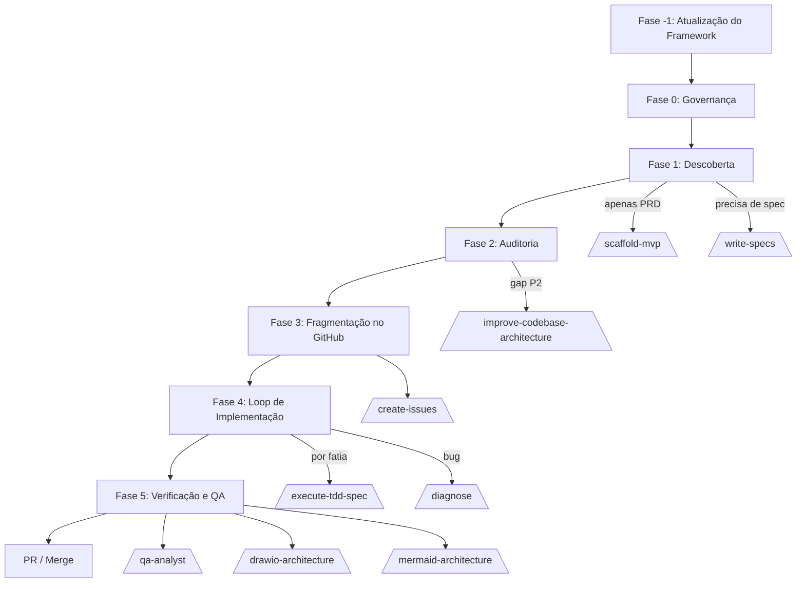

# Coleção de Agent Skills

Uma coleção curada de Agent Skills e hooks de alta performance projetados para aprimorar capacidades de IA em diversos runtimes (Claude Code, OpenCode, Devin, Cursor, etc.).

[](https://skills.sh/afonsoft/skills)
[](https://github.com/afonsoft/skills/actions/workflows/skills-validate.yml)
[](https://github.com/afonsoft/skills/actions/workflows/skills-validate.yml)
[](https://github.com/afonsoft/skills/actions/workflows/skills-validate.yml)
[](https://opensource.org/licenses/MIT)
[](https://agentskills.io)

## 🚀 Visão Geral

Este repositório fornece orientação e ferramentas especializadas seguindo a **Agent Skills Specification** (agentskills.io). Em vez de prompts genéricos, estas skills fornecem padrões estruturados, restrições e materiais de referência que permitem aos agentes realizar tarefas complexas de engenharia de software com qualidade de produção.

## 🛠️ Catálogo de Skills e Correlação

As skills estão organizadas em quatro pilares principais: **Engenharia de Harness**, **Qualidade de Código**, **Extensibilidade** e **Integrações MCP**.

### 🏗️ Engenharia de Harness
*Fundação para criação e gerenciamento de agentes de IA.*
- **[`create-agent-harness`](docs/pt-br/create-agent-harness.md)**: O ponto de partida. Use para inicializar um ambiente completo de agente (CLAUDE.md, AGENTS.md, regras, skills) em qualquer repositório. Suporta Claude Code, Devin, OpenCode, Cursor, Gemini e Antigravity.
- **[`create-readme`](docs/pt-br/create-readme.md)**: Profissionaliza a página inicial do repositório. Gera READMEs baseados em evidência e CHANGELOGs compatíveis com SemVer.
- **[`observability-and-instrumentation`](docs/pt-br/observability-and-instrumentation.md)**: Depois que o harness está configurado, use para garantir que as ações do agente e o comportamento da aplicação sejam visíveis e diagnosticáveis em produção.

### 🧭 Orquestração e Entrega
*Planejamento, execução, verificação e documentação para projetos conduzidos por agentes.*
- **[`orchestrator`](docs/pt-br/orchestrator.md)**: Skill de controle central. Audita pré-condições, cria documentação, reconcilia GitHub Issues abertas, transforma gaps em Issues e coordena execução, testes, QA e PR em um loop contínuo. Persiste o estado em `.claude/memory/orchestrator_stats.md` e continua automaticamente para a próxima fatia.
- **[`write-specs`](docs/pt-br/write-specs.md)**: Entrevista o usuário em português para consolidar a linguagem de domínio e produzir um `.specs/SPEC-{YYYYMMDD}-{feature}.md` aprovado antes da implementação.
- **[`scaffold-mvp`](skills/scaffold-mvp/SKILL.md)**: Inicializa um novo repositório .NET/Blazor/Angular após o alinhamento de domínio/spec. Instala o harness de agente, propõe uma stack produtiva e gera o esqueleto inicial do projeto, AD-0001 e stubs.
- **[`create-issues`](skills/create-issues/SKILL.md)**: Converte gaps aprovados, roadmap e specs em GitHub Issues com fatias verticais e links de dependência. Utiliza a estrutura do template de SPEC SDD ao criar Issues a partir de especificações.
- **[`execute-tdd-spec`](docs/pt-br/execute-tdd-spec.md)**: Test-driven development utilizando o SPEC SDD aprovado como única fonte de verdade. Red-green-refactor uma fatia vertical por vez.
- **[`qa-analyst`](skills/qa-analyst/SKILL.md)**: Ciclo completo de QA — análise de requisitos, plano de testes, casos de teste, execução, relatórios de bugs e melhoria contínua de processos.
- **[`diagnose`](skills/diagnose/SKILL.md)**: Diagnóstico disciplinado e loop de re-validação para bugs difíceis e regressões de performance.
- **[`improve-codebase-architecture`](skills/improve-codebase-architecture/SKILL.md)**: Identifica oportunidades de aprofundamento arquitetural lendo `.claude/CONTEXT.md`, `.claude/MEMORY.md` e `docs/architecture/`, e gera um relatório em HTML.

### 💎 Qualidade e Revisão de Código
*Garantindo que a saída atenda a padrões profissionais.*
- **[`code-review-and-quality`](docs/pt-br/code-review-and-quality.md)**: O guardião principal. Realiza revisões multi-eixo (corretude, segurança, performance) antes de qualquer código ser merged.
- **[`quality-test-implementation`](docs/pt-br/quality-test-implementation.md)**: A intervenção de qualidade em todo o repo. Corrige warnings de análise estática (Roslyn/Sonar, SpotBugs/Checkstyle, Bandit/Ruff), resolve CVEs de segurança e aplica SOLID/DDD/Clean Architecture em repositórios .NET, Java ou Python.
- **[`sonarqube-autofix`](docs/pt-br/sonarqube-autofix.md)**: O auditor automático. Integra com SonarQube para identificar e corrigir débito técnico e code smells sistematicamente.

### 🎨 Frontend e Design
*Moldar interfaces com design responsivo e mobile-first.*
- **[`design`](docs/pt-br/design.md)**: Design de UI frontend para Angular, React e Blazor. Cobre layouts responsivos mobile-first, tipografia, cor, componentes, acessibilidade, motion, design tokens, exemplos Bootstrap/Tailwind CSS e endurecimento para produção.

### 🔌 Extensibilidade e Integração
*Expandindo o que o agente pode realmente fazer.*
- **[`building-mcp-servers`](docs/pt-br/building-mcp-servers.md)**: A ferramenta de power-user. Ensina agentes a construir seus próprios servidores Model Context Protocol (MCP) para conectar a qualquer API ou banco de dados.
- **[`drawio-architecture`](docs/pt-br/drawio-architecture.md)**: Inteligência visual. Combina autoria de diagramas de arquitetura com o servidor MCP oficial do draw.io para design automatizado de sistemas.
- **[`mermaid-architecture`](docs/pt-br/mermaid-architecture.md)**: Diagramas como código. Gera diagramas de arquitetura, fluxogramas, sequências e modelos C4 em Mermaid nativo, salvos diretamente em `docs/architecture/`.
- **[`obsidian`](docs/pt-br/obsidian.md)**: Operações em vaults do Obsidian. Executa o Obsidian CLI (ler/criar/buscar/gerenciar notas, tarefas, properties), constrói Bases (views/filters/formulas em .base), escreve Obsidian Flavored Markdown (wikilinks, embeds, callouts) e desenvolve/depura plugins e temas.

### 🔗 Integrações MCP
*Configurando, autenticando e usando servidores MCP externos em todas as plataformas de agente suportadas.*
- **[`composio-mcp`](docs/pt-br/composio-mcp.md)**: Conecta agentes de IA a mais de 1000 aplicativos externos (Gmail, GitHub, Slack, Notion, Linear, Jira) via Composio. Caminho CLI-first (`ak_*` chave de projeto) com fallback MCP (`ck_*` chave de consumidor via header `x-consumer-api-key`). Inclui script de setup multiplataforma (trata `serverUrl` vs `url`, `mcp` vs `mcpServers`, `environment` vs `env` em Claude Code/Desktop, Cursor, Devin CLI/Desktop, OpenCode, Antigravity IDE/CLI, OpenClaw), script de verificação, referência de config por plataforma e matriz de peculiaridades cross-platform.
- **[`notebooklm-mcp`](docs/pt-br/notebooklm-mcp.md)**: Integração do Google NotebookLM (Gemini Notebook) via CLI `nlm` e servidor `notebooklm-mcp`. Autenticação baseada em cookies para servidores headless com três métodos (OpenClaw CDP preferencial, arquivo manual `cookies.txt`, auto desktop + cópia) e script de setup multiplataforma cobrindo todas as 8 plataformas de agente suportadas. Inclui verificação, helper de extração de cookies, referência de config por plataforma e matriz de peculiaridades cross-platform.
- **[`wordpress-mcp`](docs/pt-br/wordpress-mcp.md)**: Expõe WordPress para agentes de IA via MCP. Três caminhos: (A) plugin oficial `wordpress/mcp-adapter` (Abilities API, 3 meta-tools, HTTP+STDIO), (B) plugin AI Engine (43–109+ ferramentas admin: posts, usuários, mídia, plugins, SEO, social) e (C) wp-mcp-ultimate (58 abilities, OAuth 2.1, WP 6.7+). Inclui scripts de install via WP-CLI, setup de Application Password / Bearer Token / OAuth, config MCP por plataforma (Claude Code, Devin, OpenCode, Gemini, Codex, AGY, OpenClaw), verificação de endpoint e troubleshooting.

> 📚 **Documentação:** cada skill tem uma página de doc dedicada em [`docs/en/`](docs/en/) (Inglês) e [`docs/pt-br/`](docs/pt-br/) (Português).

## 🛡️ Auditoria de Segurança

Resultados mais recentes da auditoria de terceiros do [skills.sh](https://skills.sh) (**Gen Agent Trust Hub**, **Socket**, **Snyk**). Clique em **Ver** para ver o relatório completo de cada skill.

> **Atualizado em:** 2026-09-10

| Skill | Gen Agent Trust Hub | Socket alerts | Snyk | Detalhes |
|-------|---------------------|---------------|------|----------|
| `building-mcp-servers` | ✅ safe | 0 | 🟡 medium | [Ver](https://skills.sh/afonsoft/skills/building-mcp-servers) |
| `code-review-and-quality` | ✅ safe | 0 | 🟡 medium | [Ver](https://skills.sh/afonsoft/skills/code-review-and-quality) |
| `composio-mcp` | ✅ safe | 0 | 🟢 low | [Ver](https://skills.sh/afonsoft/skills/composio-mcp) |
| `create-agent-harness` | ✅ safe | 0 | 🟢 low | [Ver](https://skills.sh/afonsoft/skills/create-agent-harness) |
| `create-issues` | ✅ safe | 0 | 🟡 medium | [Ver](https://skills.sh/afonsoft/skills/create-issues) |
| `create-readme` | ✅ safe | 0 | 🟢 low | [Ver](https://skills.sh/afonsoft/skills/create-readme) |
| `design` | — | — | — | [Ver](https://skills.sh/afonsoft/skills/design) |
| `diagnose` | ✅ safe | 0 | 🟢 low | [Ver](https://skills.sh/afonsoft/skills/diagnose) |
| `drawio-architecture` | ✅ safe | 0 | 🟡 medium | [Ver](https://skills.sh/afonsoft/skills/drawio-architecture) |
| `execute-tdd-spec` | ✅ safe | 0 | 🟢 low | [Ver](https://skills.sh/afonsoft/skills/execute-tdd-spec) |
| `improve-codebase-architecture` | ✅ safe | 0 | 🟢 low | [Ver](https://skills.sh/afonsoft/skills/improve-codebase-architecture) |
| `mermaid-architecture` | ✅ safe | 0 | 🟢 low | [Ver](https://skills.sh/afonsoft/skills/mermaid-architecture) |
| `notebooklm-mcp` | ✅ safe | 1 | 🟢 low | [Ver](https://skills.sh/afonsoft/skills/notebooklm-mcp) |
| `observability-and-instrumentation` | ✅ safe | 0 | 🟢 low | [Ver](https://skills.sh/afonsoft/skills/observability-and-instrumentation) |
| `obsidian` | 🟡 medium | 0 | 🟢 low | [Ver](https://skills.sh/afonsoft/skills/obsidian) |
| `orchestrator` | ✅ safe | 1 | 🟡 medium | [Ver](https://skills.sh/afonsoft/skills/orchestrator) |
| `qa-analyst` | ✅ safe | 0 | 🟡 medium | [Ver](https://skills.sh/afonsoft/skills/qa-analyst) |
| `quality-test-implementation` | ✅ safe | 0 | 🟢 low | [Ver](https://skills.sh/afonsoft/skills/quality-test-implementation) |
| `scaffold-mvp` | ✅ safe | 0 | 🟢 low | [Ver](https://skills.sh/afonsoft/skills/scaffold-mvp) |
| `sonarqube-autofix` | ✅ safe | 0 | 🟡 medium | [Ver](https://skills.sh/afonsoft/skills/sonarqube-autofix) |
| `wordpress-mcp` | 🟡 medium | 1 | 🟡 medium | [Ver](https://skills.sh/afonsoft/skills/wordpress-mcp) |
| `write-specs` | ✅ safe | 0 | 🟢 low | [Ver](https://skills.sh/afonsoft/skills/write-specs) |

---

## 🧭 Fluxo do Orchestrator

O [`orchestrator`](docs/pt-br/orchestrator.md) é a skill de controle central para projetos conduzidos por agentes. Ele executa em um loop contínuo, delegando trabalho complexo para skills especializadas e persistindo o estado em `references/ESTADO_ORQUESTRADOR.md`.



O orchestrator avança automaticamente entre as fases assim que a validação passa. Ele só para em escalation gates (segurança, schema, APIs públicas, dados), falhas de validação ou pedido explícito do usuário.

## 📦 Instalação

### ⚡ via skills.sh (Recomendado)
A forma mais rápida de instalar e auto-detectar seu ambiente.
```bash
npx skills add afonsoft/skills
```

## 📣 Publicar em Diretórios de Skills

### SkillsLLM
[SkillsLLM](https://skillsllm.com/) indexa skills open-source para Claude Code, Codex CLI e ChatGPT. O scraper descobre repos diariamente via GitHub topics (`claude-code`, `ai-agent`, `mcp-server`, `agent-skills`, `skill-md`) e arquivos `SKILL.md`. Para listar esta coleção:

1. Entre com GitHub em [Submit a Skill](https://skillsllm.com/submit)
2. Submeta a URL do repositório: `https://github.com/afonsoft/skills`
3. O scraper valida, busca metadados, roda security scan (Semgrep + npm audit + pip-audit) e adiciona ao catálogo em 24 horas

> **Nota:** A descoberta automática do SkillsLLM filtra repos com 100+ stars. A submissão manual via formulário contorna esse filtro — o repo é escaneado e listado independente do número de stars. Os topics e a descrição do GitHub já estão configurados para o scraper categorizar as skills corretamente.

### Awesome Skills
[Awesome Skills](https://awesomeskill.ai/) descobre skills `SKILL.md` open-source do GitHub via seu **Awesome List Import**. Cada diretório `skills/<nome>/SKILL.md` vira uma listagem separada com slug `afonsoft-skills-<nome>`. Submeta a URL do repositório através do formulário **Submit a Skill** do site:

- **Repository URL:** `https://github.com/afonsoft/skills`
- **Branch:** `main`
- **Skills Path:** `/skills`

O `description` de cada skill inclui `afonsoft` para que a coleção seja pesquisável em [awesomeskill.ai/search?q=afonsoft](https://awesomeskill.ai/search?q=afonsoft). A API de busca do Awesome Skills matcheia apenas contra `name` e `description` (não owner, repo ou tags), então a atribuição `afonsoft` em cada descrição é o que faz a busca retornar resultados.

### SkillHub
[SkillHub](https://www.skill-marketplace.com/) agrega skills de fontes do GitHub. Abra **Sources** → **Add Source**, então use:

- **Name:** `afonsoft/skills`
- **Repository URL:** `https://github.com/afonsoft/skills`
- **Source Type:** `GitHub Repo`
- **Branch:** `main`
- **Skills Path:** `/skills`

SkillHub importa a coleção desta fonte e lista cada diretório `SKILL.md` válido em seu marketplace.

### LobeHub Skills Marketplace
[LobeHub](https://lobehub.com/skills) é o maior marketplace de skills do mundo (100.000+ skills). A publicação é via CLI (sem formulário web). Cada skill recebe o identificador `afonsoft-skills-<nome>`.

**Configuração única (por máquina, requer Node.js >= 22):**
```bash
npx -y @lobehub/market-cli login           # OAuth no navegador
npx -y @lobehub/market-cli github connect  # verificar propriedade do GitHub
```

**Publicar todas as skills localmente:**
```bash
./publish-lobehub.sh          # publica todas as skills
./publish-lobehub.sh --dry-run # preview sem publicar
```

**Publicar uma skill individual:**
```bash
npx -y @lobehub/market-cli skill publish --dir skills/<nome-da-skill> --identifier afonsoft-skills-<nome-da-skill>
```

**Publicação automática via GitHub Actions:**

Um workflow (`.github/workflows/lobehub-publish.yml`) publica todas as skills a cada push em `main`. Para habilitar, adicione dois secrets no repositório:

1. **`LOBEHUB_M2M_CREDENTIALS`** — conteúdo de `~/.lobehub-market/credentials.json` (registro do dispositivo)
2. **`LOBEHUB_USER_CREDENTIALS`** — conteúdo de `~/.lobehub-market/user-credentials.json` (tokens OAuth)

```bash
# Após rodar lhm login + lhm github connect localmente:
gh secret set LOBEHUB_M2M_CREDENTIALS < ~/.lobehub-market/credentials.json
gh secret set LOBEHUB_USER_CREDENTIALS < ~/.lobehub-market/user-credentials.json
```

O workflow restaura os dois arquivos de credenciais, verifica a auth e executa `./publish-lobehub.sh`. O refresh token renova o access token automaticamente, mantendo o workflow autenticado entre execuções.

Após publicar, as skills aparecem em `market.lobehub.com/s/skills/afonsoft-skills-<nome>` e são pesquisáveis em [lobehub.com/skills?q=afonsoft](https://lobehub.com/skills?q=afonsoft).

## 📖 Como usar

1. **Instale** a coleção usando um dos métodos acima.
2. **Invoque** uma skill no seu chat mencionando seu nome (ex.: *"Use a skill create-agent-harness para configurar este repo"*).
3. **Siga** o workflow estruturado fornecido pela skill (o agente carregará automaticamente o `SKILL.md` e seguirá o processo).

## ⚖️ Licença
MIT - Veja `LICENSE`.

## 🛠️ Ferramentas de Desenvolvimento de Skills

### skillxp
[skillxp](https://skillxp.dev/) observa o comportamento de carregamento de skills em harnesses (Claude Code, Codex CLI, Antigravity). Stage uma skill em um fixture novo, invoque o harness headless, e veja o que realmente chegou ao modelo com evidência de transcript. Instale via `brew install agent-ecosystem/tap/skillxp` ou `npm install -g skillxp`. Use `skillxp harnesses` para listar plataformas suportadas e `skillxp observe -harness <name> -install ./my-skill ...` para rastrear ativação de skills e carregamento de frases.

## 📊 Catálogo de Skills
Navegue todas as skills disponíveis em [skills.sh](https://www.skills.sh/?q=afonsoft).
